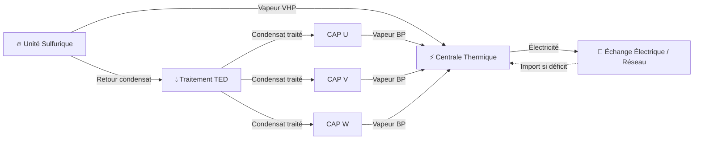
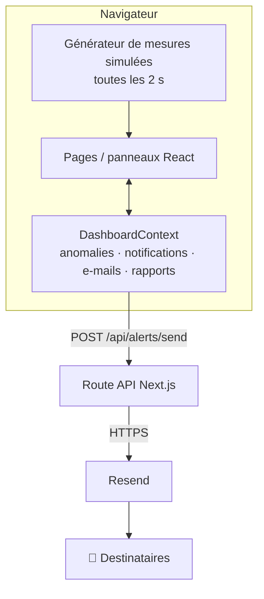

<div align="center">

# ⚡ EcoEnergy Pioneers — SCADA-IA

**Tableau de bord de supervision industrielle pour un site de cogénération :
vapeur, électricité et traitement de l'eau, en temps réel.**


</div>

---

## 📖 Sommaire

- [Présentation](#-présentation)
- [Le procédé supervisé](#-le-procédé-supervisé)
- [Fonctionnalités](#-fonctionnalités)
- [Captures d'écran](#-captures-décran)
- [Stack technique](#-stack-technique)
- [Installation](#-installation)
- [Configuration des alertes e-mail](#-configuration-des-alertes-e-mail)
- [Architecture](#-architecture)
- [Structure du projet](#-structure-du-projet)
- [Limites actuelles](#-limites-actuelles)
- [Feuille de route](#-feuille-de-route)

---

## 🎯 Présentation

**SCADA-IA** est une interface web de supervision (*Supervisory Control And Data Acquisition*) pensée pour une salle de contrôle. Elle permet à un opérateur de :

- suivre en direct la **production et la consommation électrique** du site ;
- visualiser les **flux de vapeur, de condensat et d'électricité** sur un schéma animé ;
- détecter les **anomalies** (vapeur non conforme, fuite d'eau) et recevoir une **alerte e-mail** avec des recommandations ;
- tester des **scénarios « what-if »** dans un simulateur avant de modifier les réglages réels.

> ℹ️ Il s'agit d'un **prototype de démonstration** : les mesures sont simulées côté navigateur (voir [Limites actuelles](#-limites-actuelles)).

---

## 🏭 Le procédé supervisé

Le site valorise la chaleur de la production d'acide sulfurique pour produire sa propre électricité :



| Unité | Rôle |
|---|---|
| **Unité Sulfurique** | Réaction exothermique → produit de la vapeur haute pression (VHP) et basse pression (VBP). |
| **Centrale Thermique** | Turbine à vapeur → produit l'électricité du site (≈ 65 MW). |
| **CAP U / V / W** | Lignes de concentration : consomment de l'électricité, renvoient de la vapeur BP et du condensat. |
| **Traitement TED** | Traite et recycle l'eau (≈ 92 % de recyclage), gère le stock d'eau. |
| **Échange Électrique** | Bilan net : **EXPORTATION** si la production dépasse la consommation, sinon **IMPORTATION**. |

---

## ✨ Fonctionnalités

| Module | Description |
|---|---|
| 📊 **Vue d'ensemble** | 6 KPI avec sparklines, graphique live production vs consommation, bilan électrique, tableau d'état de toutes les unités. |
| 🔀 **Schéma Procédé** | Synoptique SVG avec **flux animés** dans le sens réel de circulation ; les lignes passent au rouge et accélèrent en cas d'anomalie. |
| ⚡ **Énergie** | Production / consommation sur 24 h, sources d'énergie et répartition de la consommation. |
| 💧 **Eau** | Débits, taux de recyclage, qualité de l'eau (pH, turbidité, conductivité…), état des circuits. |
| 🏗️ **Production** | Commande des unités (démarrer, pause, arrêt, arrêt d'urgence). |
| 🧠 **Analytiques IA** | Prédictions, performance par domaine (radar) et recommandations d'optimisation. |
| 🎛️ **Simulation** | Simulateur « what-if » : sliders + saisie numérique, préréglages, résultats instantanés, écart vs nominal et contrôles de cohérence. |
| 🔔 **Alertes** | Liste filtrable des alertes avec suggestions IA ; gestion des destinataires e-mail. |
| 📄 **Rapports** | Tendances économies / coûts et rapports par unité. |
| 🌗 **Mode clair / sombre** | Bascule dans l'en-tête, choix mémorisé, appliqué à toutes les pages et aux graphiques. |

---

## 🖼️ Captures d'écran

### Vue d'ensemble

| Mode clair | Mode sombre |
|---|---|
|  |  |

### Schéma procédé animé

<p align="center">
  
</p>

| Fonctionnement normal | Anomalie « Fuite d'eau » |
|---|---|
|  |  |

### Simulation


### Autres modules

| Énergie | Eau |
|---|---|
|  |  |

| Analytiques IA | Alertes |
|---|---|
|  |  |

> 📁 Les images sont attendues dans `docs/screenshots/`. Pour les (re)générer : lancer `npm run dev`, puis faire une capture de chaque page en 1440 × 900 avec les noms ci-dessus.

---

## 🧰 Stack technique

| Technologie | Pourquoi |
|---|---|
| **Next.js 16 (App Router)** | Frontend et backend (route API) dans un seul projet. |
| **React 19 + TypeScript** | Interface en composants, typage strict des données capteurs. |
| **Tailwind CSS 4** | Style utilitaire ; le mode sombre remappe la palette via des variables CSS. |
| **Recharts** | Graphiques (aires, barres, camemberts, radar). |
| **Radix UI / shadcn** | Composants accessibles (slider, switch, card…). |
| **lucide-react** | Icônes. |
| **Resend** | Envoi des alertes e-mail depuis le serveur. |

---

## 🚀 Installation

### Prérequis

- **Node.js 20+** et **npm**
- **Git**

### Lancer en local

```bash
git clone https://github.com/hartant/ECOENERGY-PIONEERS.git
cd ECOENERGY-PIONEERS
npm install
npm run dev
```

Ouvrir **http://localhost:3000**.

### Scripts

| Commande | Action |
|---|---|
| `npm run dev` | Serveur de développement (rechargement à chaud). |
| `npm run build` | Build de production. |
| `npm start` | Démarre le build de production. |
| `npm run lint` | Vérification ESLint. |

---

## ✉️ Configuration des alertes e-mail

Les alertes sont envoyées par la route serveur `app/api/alerts/send/route.ts` via [Resend](https://resend.com). Créer un fichier **`.env.local`** à la racine :

```env
RESEND_API_KEY=re_xxxxxxxxxxxxxxxxx
NEXT_PUBLIC_EMAIL_FROM=onboarding@resend.dev
```

- Sans clé, l'application fonctionne mais affiche « Échec d'envoi email » lors d'une anomalie.
- Avec l'expéditeur `onboarding@resend.dev`, Resend n'autorise l'envoi qu'à l'adresse du compte ; pour d'autres destinataires, vérifier un domaine dans Resend.
- ⚠️ Ne jamais committer `.env.local` (déjà ignoré par `.gitignore`).

**Tester :** *Schéma Procédé* → *Test d'anomalie* → **Fuite d'eau**. Une notification apparaît et l'e-mail part vers les destinataires définis dans *Alertes*.

---

## 🏗️ Architecture



**Parcours d'une anomalie :**

1. L'opérateur déclenche *Fuite d'eau* sur le schéma.
2. `setAnomalyActive("water-leak")` met à jour le contexte global.
3. Le schéma, la vue d'ensemble et la page Eau passent en état d'alarme ; la production affichée est réduite (`dataMultiplier`).
4. Une notification critique s'affiche et l'alerte (détails + 3 suggestions IA) est envoyée par e-mail.

**Mode sombre :** la classe `dark` sur `<html>` redéfinit les variables de couleur de Tailwind (`--color-slate-*`, `--color-emerald-*`…) dans `app/globals.css`. Les classes existantes s'adaptent donc sans duplication, y compris le SVG et les graphiques qui utilisent `var(--color-…)`.

---

## 📂 Structure du projet

```
├── app/
│   ├── layout.tsx               # HTML racine, police, script du thème
│   ├── page.tsx                 # Page principale → <ScadaDashboard />
│   ├── globals.css              # Tailwind, palette du mode sombre, animation des flux
│   └── api/alerts/send/route.ts # Envoi des e-mails (serveur)
├── components/
│   ├── scada-dashboard.tsx      # Navigation entre les modules
│   ├── theme-toggle.tsx         # Bouton clair / sombre
│   ├── scada/
│   │   ├── sidebar.tsx · header.tsx · notification-center.tsx
│   │   ├── process-diagram.tsx  # Vue d'ensemble
│   │   ├── process-schema.tsx   # Schéma procédé animé
│   │   ├── simulation-panel.tsx # Simulateur what-if
│   │   ├── energy-panel.tsx · water-panel.tsx · production-panel.tsx
│   │   └── analytics-panel.tsx · alerts-panel.tsx · reports-panel.tsx
│   └── ui/                      # Composants de base (shadcn)
├── context/dashboard-context.tsx # État global partagé
└── docs/screenshots/            # Images du README
```

---

## ⚠️ Limites actuelles

- **Données simulées** : les mesures sont générées dans le navigateur (marche aléatoire bornée). Aucune connexion à un automate (PLC) ou à un historian.
- **Pas de base de données** : alertes, destinataires et rapports sont perdus au rechargement de la page.
- **« IA »** : prédictions et recommandations sont des valeurs de démonstration, pas un modèle entraîné.
- **Simulation** : modèle simplifié à coefficients indicatifs, à calibrer avec les données du site.
- **Rapports** : les boutons PDF / Excel ne génèrent pas encore de fichier.
- **Pas d'authentification** des opérateurs.

---

## 🗺️ Feuille de route

- [ ] Base de données **PostgreSQL / TimescaleDB** pour l'historique des mesures et des alertes
- [ ] Acquisition réelle via **OPC UA / Modbus** depuis les automates
- [ ] Modèle de **prédiction** entraîné sur l'historique (consommation, stock TED)
- [ ] Export **PDF / Excel** des rapports
- [ ] **Authentification** et rôles (opérateur, ingénieur, administrateur)
- [ ] Échappement HTML du contenu des e-mails d'alerte

---

<div align="center">

Réalisé par l'équipe **EcoEnergy Pioneers**

</div>